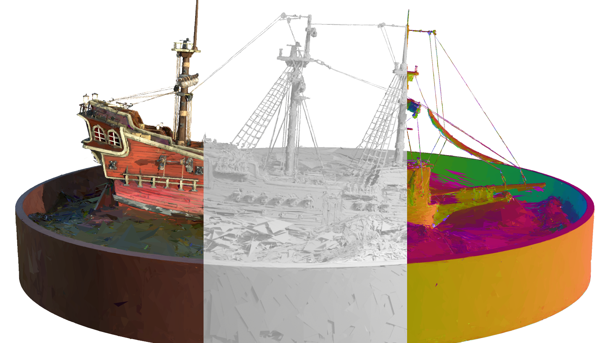
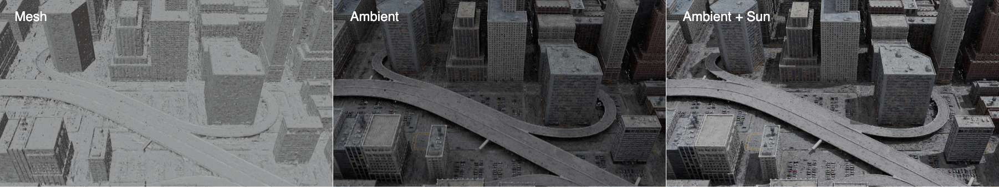
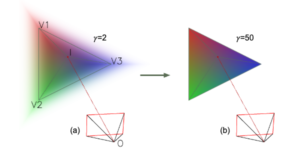

<div align="center">

# 2D Triangle Splatting for Direct Differentiable Mesh Training

[Arxiv][1] | [Project Page][4]

Kaifeng Sheng*, Zheng Zhou*, Yingliang Peng, Qianwei Wang (*Equal Contribution)

Amap, Alibaba Group

</div>

## - Project Overview

Official implementation of [2DTS][1] (2D Triangle Splatting for Direct Differentiable Mesh Training)

We provide a complete training pipeline for 2DTS, a differentiable 3D Geometric Representation adapted from [3DGS][2] (3D Gaussian Splatting) that replace the Gaussians primitives with triangle primitives, while retaining the full differentiability of the model.
The proposed method is capable of producing triangle meshes with high visual fidelity through an end-to-end training pipeline.

This checkout contains the 2DTS pipeline only. Standalone 3DGS and hybrid Gaussian/triangle rendering have been removed. The two native dependencies are `simple-knn` and `diff-triangle-rasterization`; point-cloud initialization accepts RGB or SH DC colors from PLY files. Triangle mesh and GLB/glTF utilities remain available.



Our method can be applied to large-scale datasets, such as MatrixCity, which contains 6000+ images. Such datasets are challenging for existing mesh reconstruction methods, but our method can handle them efficiently.
The reconstructed meshes can be directly used in modern game engines, such as Blender, for relighting, shadow rendering, and other advanced rendering effects. See the following image for an example of relighting effect on a reconstructed mesh from MatrixCity dataset:



## - Abstract

Differentiable rendering with 3D Gaussian primitives has emerged as a powerful method for reconstructing high-fidelity 3D scenes from multi-view images.
While it offers improvements over NeRF-based methods, this representation still encounters challenges with rendering speed and advanced rendering effects, such as relighting and shadow rendering, compared to mesh-based models.
In this paper, we propose 2D Triangle Splatting (2DTS), a novel method that replaces 3D Gaussian primitives with 2D triangle facelets.
This representation naturally forms a discrete mesh-like structure while retaining the benefits of continuous volumetric modeling.
By incorporating a compactness parameter into the triangle primitives, we enable direct training of photorealistic meshes.
Our experimental results demonstrate that our triangle-based method, in its vanilla version (without compactness tuning), achieves higher fidelity compared to state-of-the-art Gaussian-based methods.
Furthermore, our approach produces reconstructed meshes with superior visual quality compared to existing mesh reconstruction methods.

## - Installation

For this checkout's Python 3.12 / CUDA 13.0 environment, use [`environment.yml`](./environment.yml) and the steps below.

1. Prepare CUDA Toolkit 13.0 and the host C++ compiler, and set `CUDA_HOME` to the toolkit path. On Windows, use an x64 Visual Studio developer shell.
2. From this checkout's root, create the environment: `conda env create -f environment.yml`.
3. Activate it: `conda activate 2DTS`.
4. Build the native dependencies: `python -m pip install --no-build-isolation --no-deps ./submodules/simple-knn ./submodules/diff-triangle-rasterization`.
5. Install the project: `python -m pip install --no-build-isolation --no-deps -e .`.

### Install with AI

If you use an AI coding agent in your editor or terminal, you can ask it to install this repository for you. Make sure CUDA Toolkit 13.0 is already installed and that `CUDA_HOME` is set correctly.

From the project root, give the agent a prompt like this:

```text
Install this 2DTS repository for local development using environment.yml. Activate 2DTS, build simple-knn and diff-triangle-rasterization with --no-build-isolation --no-deps, then install the root package with the same flags and -e . Verify the CUDA toolkit, host compiler, extension imports, and a small CUDA forward/backward run.
```


## - Usage
### Training
Execute `run_experiments.py` to train 2DTS models on one of Mip-NeRF 360, NerfSynthetic, DTU, Tanks and Blending, Tanks and Temples, or MatrixCity datasets by running the following command:
```bash
python run_experiments.py --type {experiment_type} --dataset_path /path/to/dataset --num_workers 0
```
`experiment_type` can be one of `MipNerf360`, `NerfSynthetic`, `DTU`, `TanksAndBlending`, `TanksAndTemples`, or `MatrixCity`.

The script requires the dataset to be downloaded beforehand, and the dataset path should point to the root directory of the dataset.
For example, if you want to train on the NerfSynthetic dataset, and have the dataset stored in `./data/nerf_synthetic`, you can run the following command:
```bash
python run_experiments.py --type NerfSynthetic --dataset_path ./data/nerf_synthetic --num_workers 0
```

### Logs
Training logs will be saved in the `./outputs` directory. You can use TensorBoard to visualize the training process:
```bash
tensorboard --logdir ./outputs
```

### Rendering

Native viewer for trained 2DTS models and ordinary triangle meshes. Run commands
from the repository root with the `2DTS` environment activated.

```powershell
python -m pip install "moderngl==5.12.0" "glcontext==3.0.0" "glfw==2.10.2" "imgui-bundle==1.92.900" "PyOpenGL==3.1.10"
python -m py_viewer.viwer --model outputs/baselines/lego_20260921_135232/mesh/ckpt/60000.ckpt
```

The Lego baseline's `mesh.yaml` and NeRF camera directory are detected
automatically. For another checkpoint, supply its training configuration:

```powershell
python -m py_viewer.viwer --model path/to/model.ckpt --config path/to/config.yaml --cameras data/nerf_synthetic/lego
```

Start with `python -m py_viewer.viwer` to open an empty window. Enter a file path and
press **Open**, or drop a file into the window. Multiple `--model` paths populate
the **Model** selector; only the selected model is loaded.

```powershell
python -m py_viewer.viwer --model outputs/baselines/lego_20260921_135232/mesh/ckpt/60000.ckpt outputs/baselines/lego_20260921_135232/mesh/glb/60000.glb
```

The Python source is organized into three files:

| File | Responsibility |
| --- | --- |
| `py_viewer/scene.py` | Settings, camera geometry, NeRF viewpoints and mesh loading |
| `py_viewer/render.py` | OpenGL resources and the existing CUDA renderer adapter |
| `py_viewer/viwer.py` | Window, controls, event loop and command-line entrypoint |

GLSL sources are stored separately in `py_viewer/shaders/`: `image.vert`,
`image.frag`, `mesh.vert`, and `mesh.frag`. Renderers load them relative to
`render.py`, independently of the working directory, when creating a GL program.

The entrypoint is now `python -m py_viewer.viwer`; the former package-level
`python -m py_viewer` entrypoint was removed. Viewer dependencies are optional;
NumPy, SciPy, trimesh, Pillow, PyYAML and plyfile come from the `2DTS` environment.

#### Controls

| Action | Control |
| --- | --- |
| Orbit | Left drag on the viewport |
| Pan | Right or middle drag |
| Dolly | Mouse wheel |
| Fit the model | **F** or **Fit model** |
| Dataset viewpoint | **Camera**, then **View** |
| Save displayed image | **Save viewport PNG**; defaults to `outputs/viewer/` |

Camera navigation switches a dataset camera to **Free**. GT remains tied to its
dataset viewpoint. Dataset image aspect ratios are preserved when resizing the
window. **Resolution** sets the longest image dimension, independently of the
window size. The renderer reuses the last image until the scene or view changes.

#### Rendering contracts

| Input | Rendering |
| --- | --- |
| 2DTS `.ckpt` | Existing CUDA renderer; runtime SH degree, gamma and opacity floor restored from the checkpoint, remaining settings from its YAML |
| 2DTS custom `.ply` | Existing CUDA renderer; SH layout inferred from the file, runtime settings inferred from YAML schedules and a numeric iteration filename |
| Indexed `.ply`, `.obj`, `.glb`, `.gltf` | ModernGL triangles; scene transforms, vertex/face colors and base-color textures |

Custom PLY files are distinguished by their triangle-coordinate and opacity
properties, not just their extension. PLY does not contain the full checkpoint
runtime state; check its displayed settings when the configuration or iteration
is unavailable. A checkpoint and its YAML are preferable for baseline comparison.
View-specific color-affine correction is disabled for arbitrary-view rendering.

2DTS provides RGB, Depth, Normal and Alpha modes, gamma/SH/sorting/opacity controls,
backface culling and supersampling. Depth is a min/max visualization of the
CUDA renderer's accumulated depth, including background depth; it is not a metric
depth export. Normals are the accumulated normals transformed to world coordinates
and mapped to RGB, without replacing them with unit surface normals. Alpha is the
renderer's coverage output. GT uses the selected image and current background.

The mesh path is an **opaque, unlit base-color preview**, with world-space flat
normals and wireframe. It does not implement PBR lighting, material alpha blending,
skinning or animation playback. It does not aim to match CUDA splat compositing.
The camera loader supports NeRF/Blender `transforms_*.json`; other dataset camera
formats can still be viewed with the free camera but need a separate preset loader.

2DTS requires the project's working PyTorch/CUDA extensions. Ordinary mesh
rendering and `--help` do not import Torch. The CUDA image currently crosses CPU
memory before its OpenGL upload; CUDA/OpenGL zero-copy interop is not implemented.
**Render call** is CPU wall time for the render call, not a GPU timer or FPS measure.

#### Verification

Check dependencies and the command-line entrypoint without opening a window:

```powershell
python -m pip check
python -m py_viewer.viwer --help
```

Bounded command-line rendering:

```powershell
python -m py_viewer.viwer --model outputs/baselines/lego_20260921_135232/mesh/ckpt/60000.ckpt --headless --frames 3 --screenshot outputs/viewer/lego.png --report outputs/viewer/lego.json
```

`--headless` means a hidden GLFW window; a working desktop OpenGL driver is still
required. Snapshots contain the rendered viewport, with RGB uint8 conversion
performed once by the framebuffer. The bounded run closes the window it creates.

The legacy [Viser viewer][3] remains in `viser_viewer.py` and requires Viser,
which is excluded from `environment.yml`.

## - Notes
We provided two distinct training configurations: VanillaTS and VanillaTS_mesh.
- VanillaTS is a close mimick of the original 3DGS method, with compactness parameter set to 1.0 and generating transparent and diffuse triangle splats (See [2DTS][1] for details).
- VanillaTS_mesh will produce a solid triangle mesh at the end of training through a compactness annealing process. The triangle mesh is saved in the `.ply` and `.glb` formats. Note that when **back_culling** is **disabled** for the training process, **the mesh file will contain each triangle <span style="color:red">twice</span>**, once for the front face and once for the back face.

The difference between a diffuse and a solid triangle is visualized in the following image:

 

## - License

This repository contains code under **two different licenses**:

- 🟥 **Gaussian Splatting Research License** — applies to components derived from the original [Gaussian Splatting][2] project:
  - `submodules/simple-knn/`
  - These components are licensed for **non-commercial research use only**.
  - See [LICENSE.gausplat.md](./LICENSE.gausplat.md)

- 🟩 **MIT License** — applies to other parts of the repository, including:
  - `src/diff_recon/`
  - `submodules/diff-triangle-rasterization/`
  - See [LICENSE](./LICENSE)

Please make sure to comply with both licenses when using this repository.

## - Citation

If you find our work useful, please consider citing our paper:
```bibtex
@misc{sheng20252dtrianglesplattingdirect,
      title={2D Triangle Splatting for Direct Differentiable Mesh Training}, 
      author={Kaifeng Sheng and Zheng Zhou and Yingliang Peng and Qianwei Wang},
      year={2025},
      eprint={2506.18575},
      archivePrefix={arXiv},
      primaryClass={cs.CV},
      url={https://arxiv.org/abs/2506.18575}, 
}
```

<!-- Reference -->
[1]: https://arxiv.org/abs/2506.18575
[2]: https://repo-sam.inria.fr/fungraph/3d-gaussian-splatting/
[3]: https://github.com/nerfstudio-project/viser
[4]: https://gaoderender.github.io/triangle-splatting/
